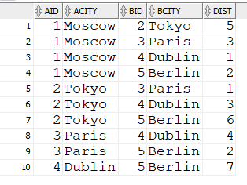
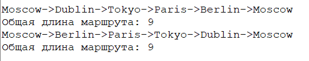

# traveling-salesman-plsql

Нахождение кратчайших замкнутых маршрутов между всеми городами при условии, что в каждый город можно заходить только по одному разу.

Имеется n городов с номерами 1, 2, ..., n, для каждой пары городов i и j задано расстояние c[i, j] между ними. Выезжая из города 1, путешественик должен побывать во всех остальных городах по одному разу и вернуться в исходный город 1.  Определить, в каком порядке следует объезжать города, чтобы суммарное  пройденное расстояние было наименьшим.
Если имеется несколько кратчайших замкнутых маршрутов, то должна быть выведена информация обо всех таких маршрутах. Расстояния между городами заданы в таблице CITIES со столбцами: 
*	AID, BID – идентификаторы городов отправления и назначения; 
*	ACITY, BCITY - названия городов отправления и назначения; 
*	DIST – расстояние между городами.

Отсутствие значения DIST свидетельствует о том, что маршрут между городами проходить  не может. 

Если исходные данные в таблице не позволяют получить решение, то вывести соответствующее сообщение. 

Пример состояния таблицы CITIES:

Пример представления результата:

